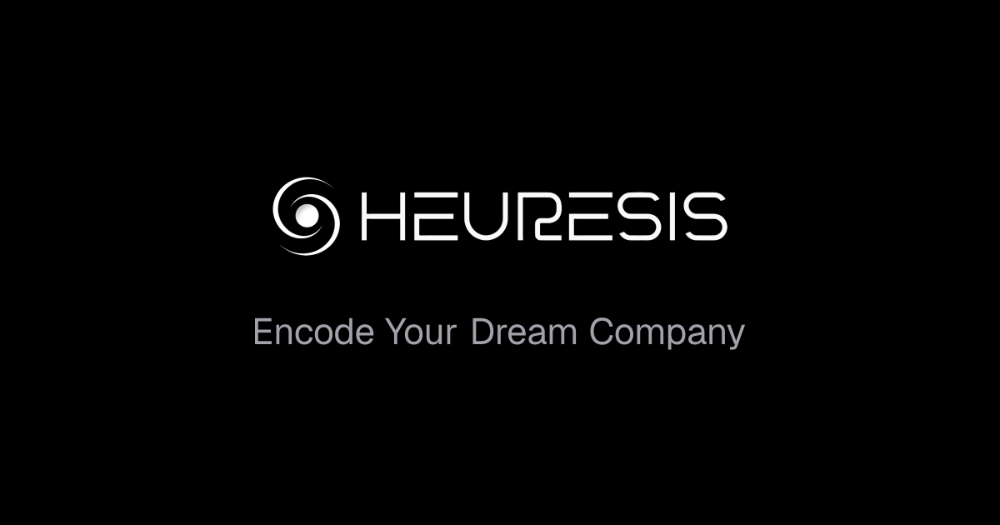

<div align="center">



<br/>
<br/>

A workspace you own. Every department encoded.

[Website](https://heuresis.ai) · [Manifesto](https://heuresis.ai/manifesto) · [Method](https://heuresis.ai/method) · [Templates](https://heuresis.ai/templates)

</div>

---

Heuresis is the encoding layer for companies. We take the business a founder
already runs — the pricing logic, the qualification instincts, the quality
standards, the patterns carried in their head — and render it as a system. A
workspace of blocks, agents, and decision rules that a human and a machine can
both read.

The workspace is plain markdown. The agents carry the founder's judgement. The
runtime is replaceable. What stays is the encoded company.

## Workspaces

| Repo | What it is |
|---|---|
| [Growth-Operator-Agency](https://github.com/Heuresis/Growth-Operator-Agency) | High-ticket creator business, encoded — 41 agents across foundations, marketing, nurture, sales, launch, scale, partnerships |
| [YouTube-Agency](https://github.com/Heuresis/YouTube-Agency) | YouTube channel, encoded — agents for ideation, hooks, retention, scripts, thumbnails, distribution |
| [LinkedIn-Agency](https://github.com/Heuresis/LinkedIn-Agency) | B2B LinkedIn agency, encoded — ghostwriting, outbound, qualification, fulfillment, high-ticket programs |

Each workspace is an org chart in code. Clone the folder, fill in
`company.yaml`, and hand it to the agentic tool of your choice.

## Get started

```bash
git clone https://github.com/Heuresis/Growth-Operator-Agency.git
cd Growth-Operator-Agency
./boot.sh
./scripts/install.sh --tool claude-code
```

Eleven runtimes supported: Claude Code, GitHub Copilot, Antigravity,
Gemini CLI, OpenCode, Cursor, Aider, Windsurf, OpenClaw, Qwen Code, Kimi Code.

## How encoding works

Every workspace ships in three layers:

- **`SYSTEM.md`** — the boot file. Any agentic tool reads it and becomes the
  operator of that workspace.
- **`agents/`** — one markdown file per agent. The org chart written down,
  with each agent's role, scope, decision authority, and escalation paths.
- **`skills/`** — one folder per capability. Each skill produces one named
  asset, with frameworks and reference attached.

The folder is the contract. The agents carry the founder's standards into
every output. The receipts compound.

---

<div align="center">

<sub><a href="https://heuresis.ai">heuresis.ai</a></sub>

</div>
